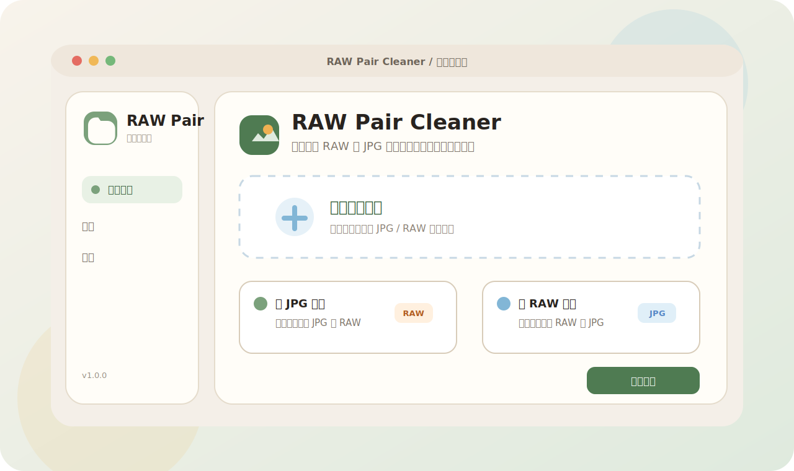
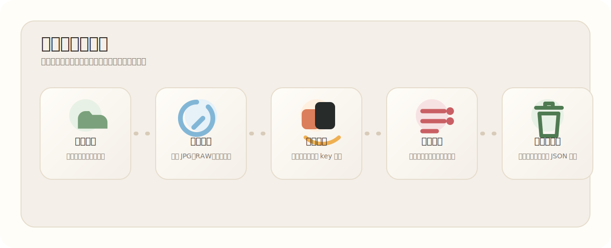
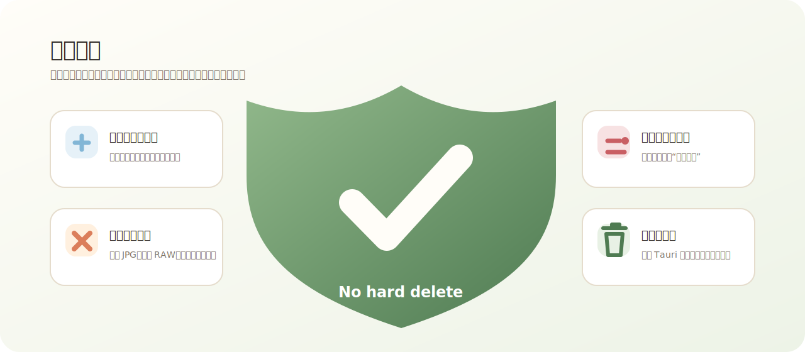

# RAW Pair Cleaner / 底片清理器

<p align="center">
  
</p>

<p align="center">
  一个用于对比 JPG 类图片与 RAW 文件配对关系，并把冗余文件安全移入系统回收站的桌面工具。
  <br />
  A safe desktop cleaner for matching JPG-like previews and RAW photo files.
</p>

<p align="center">
  <strong>默认语言：简体中文</strong>
  ·
  <a href="#english-readme">English</a>
</p>

<p align="center">
  
  
  
  
</p>



## 项目简介

RAW Pair Cleaner 面向有大量摄影素材的用户：你可能会保留 RAW 原片，同时导出 JPG、HEIC、TIFF、WebP 等预览或成片。本工具会扫描选中的照片目录，根据无扩展名的小写文件名 key 对比 JPG 类图片与 RAW 文件，找出在当前删除模式下没有匹配关系的冗余文件。

它的默认设计是保守和安全的：所有待删除文件都会先展示给用户，冲突文件不会自动删除，前端渲染进程不会直接访问文件系统，真正的删除动作也只会移动到系统回收站 / 废纸篓。

## 功能特性

- **两种清理模式**
  - 以 JPG 类图片为准：删除没有对应 JPG 的 RAW 文件。
  - 以 RAW 文件为准：删除没有对应 RAW 的 JPG 类图片。
- **安全复核流程**
  - 展示扫描结果、匹配对、冲突项、待删除候选和预计释放空间。
  - 删除前可取消勾选单个或批量候选文件。
- **冲突保护**
  - 重复 JPG key、重复 RAW key、歧义匹配都会被标记为冲突，并排除出自动删除候选。
- **只进系统回收站**
  - 通过 Tauri 后端把文件移动到系统回收站 / 废纸篓。
  - 不使用硬删除方式移除用户照片文件。
- **操作日志**
  - 开启设置后，会在 Tauri 应用数据目录下生成 JSON 删除日志。
- **桌面端体验**
  - Tauri v2 桌面壳、React 渲染层、自定义标题栏、侧边栏导航和适合桌面窗口的布局。

## 工作流程



1. 选择或拖入照片目录。
2. 选择清理模式。
3. 扫描 JPG 类图片、RAW、附属文件和未知文件。
4. 按无扩展名的小写文件名 key 分组比较。
5. 查看待删除候选与冲突项。
6. 二次确认后，将选中文件移动到系统回收站。
7. 如果开启日志，写入 JSON 操作日志。

## 安全模型



核心安全规则属于产品约束：

- 删除候选必须在删除前可见。
- 开启确认文本后，删除前必须完成二次确认。
- 冲突文件绝不自动删除。
- `.xmp`、`.dop`、`.cos`、`.on1`、`.pp3` 等附属文件会被识别，但默认不会随 RAW 删除。
- 渲染层必须通过 `src/lib/api.ts` 使用桌面能力。
- 用户照片文件必须移动到系统回收站 / 废纸篓，不能用硬删除文件系统 API 移除。

## 匹配规则

文件匹配使用标准化 key：

```txt
IMG_0001.JPG -> img_0001
IMG_0001.CR3 -> img_0001
```

如果同一个 key 下正好有一个 JPG 类文件和一个 RAW 文件，它们会被视为匹配对。如果任意一侧存在多个文件，这组文件会被标记为冲突并排除出自动清理候选。

## 支持的文件类型

JPG 类图片包含常见图片和预览格式，例如 `.jpg`、`.jpeg`、`.png`、`.heic`、`.heif`、`.hif`、`.tif`、`.tiff`、`.webp`、`.avif`、`.bmp`。

RAW 文件包含常见相机 RAW 格式，例如 `.cr2`、`.cr3`、`.nef`、`.arw`、`.raf`、`.rw2`、`.orf`、`.dng`、`.3fr`、`.iiq`、`.srw`、`.r3d` 等。

权威扩展名列表位于 [`shared/fileExtensions.ts`](shared/fileExtensions.ts)，并需要与 Rust 服务侧类型保持一致。

## 技术栈

- [Tauri v2](https://tauri.app/)：桌面应用壳和原生命令。
- [React](https://react.dev/) + [TypeScript](https://www.typescriptlang.org/)：渲染层。
- [Vite](https://vite.dev/)：前端开发和构建。
- [Tailwind CSS](https://tailwindcss.com/)：界面样式。
- [Vitest](https://vitest.dev/)：TypeScript 测试。
- Rust 服务：位于 `src-tauri/src/services/`，负责扫描、对比、回收站、日志和设置。

## 快速开始

### 环境要求

- 与项目依赖兼容的 Node.js。
- pnpm。
- Rust 以及对应操作系统的 Tauri 依赖。

平台依赖可参考 Tauri 官方文档：<https://tauri.app/start/prerequisites/>

### 安装依赖

```bash
pnpm install
```

### 开发运行

```bash
pnpm dev
```

该命令会启动 Vite 渲染层，并打开 Tauri 桌面应用。

### 构建渲染层

```bash
pnpm build
```

该命令会执行 TypeScript 检查，并将 Vite 渲染层构建到 `dist/`。

### 构建桌面安装包

```bash
pnpm dist
```

当前脚本在 macOS 上会构建 macOS DMG。

### 运行测试

```bash
pnpm test
```

运行单个测试文件：

```bash
pnpm test tests/core.test.ts
```

## 项目结构

```txt
.
├── shared/                  # 共享 TypeScript 类型、常量、扩展名和文件工具
├── src/                     # React 渲染层
│   ├── components/          # 可复用 UI 组件
│   ├── lib/api.ts           # 渲染层访问 Tauri 能力的门面
│   └── pages/               # 页面级界面
├── src-tauri/               # Tauri 应用壳和 Rust 后端
│   ├── icons/               # 生成后的应用图标
│   ├── src/main.rs          # 命令注册和应用启动
│   └── src/services/        # 扫描、对比、回收站、日志、设置服务
├── tests/                   # Vitest 测试
└── RAW_PAIR_CLEANER_DEV_DOC.md
```

## 开发说明

- 修改 Tauri 命令面时，需要同步 `src/lib/api.ts`、`src-tauri/src/main.rs` 和 `src-tauri/src/services/types.rs`。
- 修改扩展名时，需要同步 `shared/fileExtensions.ts` 和 Rust 服务侧类型。
- `package.json` 当前没有配置 `lint` 脚本；基础验证命令是 `pnpm build` 和 `pnpm test`。
- 不要在渲染进程中引入直接文件系统访问。

## 隐私

RAW Pair Cleaner 是本地桌面工具。文件扫描、匹配、删除、设置和日志都在本地 Tauri 应用内完成，核心流程不需要云同步或远程图片处理。

## 贡献指南

欢迎贡献。建议的流程：

1. 先创建 issue 或在 PR 中清楚描述要解决的问题。
2. 行为变更需要符合上面的安全模型。
3. 修改匹配逻辑、渲染层工具或后端服务时，请补充聚焦测试。
4. 提交 PR 前运行 `pnpm build` 和 `pnpm test`。

## 路线图

- 为 scanner、compare、trash、log、settings 等 Rust 服务补充测试。
- 改进冲突解释和批量复核体验。
- 增加可选附属文件处理流程，但保持“默认不删除附属文件”。
- 补充更多桌面平台的发布产物。

## 许可证

当前仓库尚未包含许可证文件。正式开源前，请选择并添加明确许可证，例如 MIT、Apache-2.0 或 GPL-3.0。

<details id="english-readme">
<summary>English README</summary>

## Overview

RAW Pair Cleaner is built for photographers who keep RAW originals while exporting JPG-like previews or finished images. It scans a selected photo directory, compares JPG-like files and RAW files by extensionless lowercase basename, and highlights unmatched files according to the selected cleanup mode.

The default behavior is intentionally conservative: every pending deletion is shown before execution, conflict files are never auto-deleted, the renderer process does not access the filesystem directly, and deletion moves files to the system trash/recycle bin.

## Features

- **Two cleanup modes**
  - Use JPG-like files as the source of truth and remove unmatched RAW files.
  - Use RAW files as the source of truth and remove unmatched JPG-like files.
- **Safe review flow**
  - Shows scan results, matched pairs, conflicts, pending delete candidates, and estimated reclaimable size.
  - Allows individual or batch deselection before deletion.
- **Conflict protection**
  - Duplicate JPG keys, duplicate RAW keys, and ambiguous matches are reported as conflicts and excluded from delete candidates.
- **Trash-first deletion**
  - Files are moved to the system trash/recycle bin through the Tauri backend.
  - User photo files are not hard-deleted.
- **Operation logs**
  - Optional JSON delete logs are written under the Tauri app data directory.
- **Desktop-focused UI**
  - Tauri v2 desktop shell, React renderer, custom title bar, sidebar navigation, and desktop-oriented layout.

## Workflow

1. Select or drag in a photo directory.
2. Choose a cleanup mode.
3. Scan JPG-like, RAW, sidecar, and unknown files.
4. Compare groups by extensionless lowercase basename.
5. Review delete candidates and conflicts.
6. Confirm, then move selected files to the system trash.
7. Write a JSON operation log when logging is enabled.

## Safety Model

The product safety rules are:

- Deletion candidates must be visible before deletion.
- Confirmation UI is required when enabled in settings.
- Conflicts are never deleted automatically.
- Sidecar files such as `.xmp`, `.dop`, `.cos`, `.on1`, and `.pp3` are recognized but are not deleted by default.
- Renderer code must go through `src/lib/api.ts` for desktop capabilities.
- User photo files must be moved to the system trash/recycle bin, not removed with hard-delete filesystem APIs.

## Matching Rules

File matching uses a normalized key:

```txt
IMG_0001.JPG -> img_0001
IMG_0001.CR3 -> img_0001
```

If exactly one JPG-like file and one RAW file share a key, they are treated as a matched pair. If multiple files of either kind share the same key, the group is marked as a conflict and excluded from automatic cleanup.

## Supported File Types

JPG-like files include common image and preview formats such as `.jpg`, `.jpeg`, `.png`, `.heic`, `.heif`, `.hif`, `.tif`, `.tiff`, `.webp`, `.avif`, and `.bmp`.

RAW files include common camera RAW formats such as `.cr2`, `.cr3`, `.nef`, `.arw`, `.raf`, `.rw2`, `.orf`, `.dng`, `.3fr`, `.iiq`, `.srw`, `.r3d`, and more.

The canonical extension lists live in [`shared/fileExtensions.ts`](shared/fileExtensions.ts) and should stay aligned with the Rust service-side types.

## Tech Stack

- [Tauri v2](https://tauri.app/) for the desktop shell and native commands.
- [React](https://react.dev/) and [TypeScript](https://www.typescriptlang.org/) for the renderer.
- [Vite](https://vite.dev/) for frontend development and builds.
- [Tailwind CSS](https://tailwindcss.com/) for UI styling.
- [Vitest](https://vitest.dev/) for the TypeScript test suite.
- Rust services under `src-tauri/src/services/` for scanning, comparison, trash, logs, and settings.

## Getting Started

### Prerequisites

- Node.js compatible with the project dependencies.
- pnpm.
- Rust and the Tauri system prerequisites for your operating system.

See the official Tauri setup guide for platform-specific dependencies: <https://tauri.app/start/prerequisites/>

### Install

```bash
pnpm install
```

### Run In Development

```bash
pnpm dev
```

This starts the Vite renderer and launches the Tauri desktop app.

### Build Renderer

```bash
pnpm build
```

This runs TypeScript checking with `tsconfig.json --noEmit` and builds the Vite renderer into `dist/`.

### Build Desktop Bundle

```bash
pnpm dist
```

The current script builds a macOS DMG when run on macOS.

### Run Tests

```bash
pnpm test
```

Run a single test file:

```bash
pnpm test tests/core.test.ts
```

## Project Structure

```txt
.
├── shared/                  # Shared TypeScript types, constants, extensions, and file helpers
├── src/                     # React renderer
│   ├── components/          # Reusable UI components
│   ├── lib/api.ts           # Renderer facade for Tauri desktop capabilities
│   └── pages/               # Page-level screens
├── src-tauri/               # Tauri application shell and Rust backend
│   ├── icons/               # Generated app icons
│   ├── src/main.rs          # Command registration and app bootstrap
│   └── src/services/        # Scanner, compare, trash, log, settings services
├── tests/                   # Vitest tests
└── RAW_PAIR_CLEANER_DEV_DOC.md
```

## Development Notes

- Keep `src/lib/api.ts`, `src-tauri/src/main.rs`, and `src-tauri/src/services/types.rs` in sync when changing the Tauri command surface.
- Keep file extension constants aligned between `shared/fileExtensions.ts` and the Rust service types.
- There is currently no `lint` script in `package.json`; use `pnpm build` and `pnpm test` as the baseline verification commands.
- Do not introduce direct filesystem access in the renderer process.

## Privacy

RAW Pair Cleaner is a local desktop utility. File scanning, comparison, deletion, settings, and logs are handled locally through the Tauri application. The core workflow does not require cloud sync or remote image processing.

## Contributing

Contributions are welcome. For a clean change:

1. Open an issue or describe the problem the pull request solves.
2. Keep behavior changes aligned with the safety model above.
3. Add focused tests for compare logic, renderer helpers, or backend services when behavior changes.
4. Run `pnpm build` and `pnpm test` before opening a pull request.

## Roadmap

- Add Rust-side tests for scanner, compare, trash, log, and settings services.
- Improve conflict explanations and batch review ergonomics.
- Add optional sidecar handling flows without making sidecar deletion the default.
- Add release artifacts for more desktop platforms.

## License

This repository does not currently include a license file. Before publishing as an open-source project, choose and add an explicit license such as MIT, Apache-2.0, or GPL-3.0.

</details>
